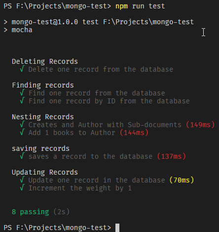

# MongoDB with MongooseJS and Mocha
1. Creating and Dropping Document
2. Create Collection using Mongoose Schema and Models
3. Finding Records
4. Create Nested Records
5. Deleting Records
6. Updating Records

## To run the application

* Clone the Repo
* npm install
* npm run test

## Preview
[]